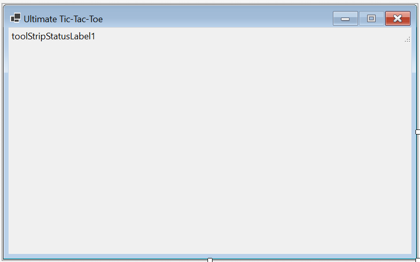
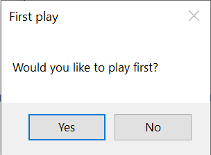
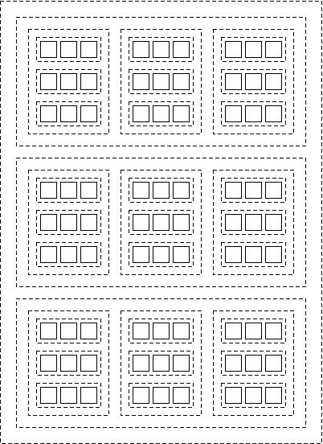

# Homework Assignment 4: Ultimate Tic-Tac-Toe

For this assignment, you will write a program to play Ultimate Tic-Tac-Toe against the user.

## 0. Contents

[TOC]

## 1. User Requirements

A software company wishes to market an application for the 2-player game, Ultimate Tic-Tac-Toe. The game board is a tic-tac-toe board containing nine tic-tac-toe boards:


Players take turns placing their symbols into one of the unoccupied squares of one of the nine smaller boards. The first player to play uses symbol 'X', and the other player uses symbol 'O'. Plays are made according to the following rules:

1. The first play of the game may be made to any of the 81 squares.
2. When one of the nine smaller boards contains three of the same symbol in a straight line, horizontally, vertically, or diagonally, the player playing that symbol has won that board. No further plays are allowed on that board.
3. After the first play, the legal plays are determined by the previous play. Specifically, if the last play was to row *i* and column *j* of some smaller board, then the next play must be to the smaller board on row *i* and column *j* of the larger board. If this board is full or has been won, then this play can be made to any board that has not been won.
4. If a player wins three smaller boards in a straight line, horizontally, vertically, or diagonally, that player wins.
5. If at some point no legal plays remain and neither player has won, the game is a draw.

Examples of these rules can be found [here](https://mathwithbaddrawings.com/2013/06/16/ultimate-tic-tac-toe/) and in the [demo video]().

The program must implement game play against a user. The user should be able to decide who plays first. Only one level of difficulty is required - this level should challenge a novice player. However, the implementation should be adaptable so that different difficulty levels could be readily incorporated into future versions. When the game is over, an indication of the game's outcome should be given.

## 2. Starting the Assignment

Create a GitHub repository using the link provided in the Canvas assignment and clone it to your local machine. This repository should contain a Visual Studio solution containing a new Windows Forms Application with an additional unit test project, **Ksu.Cis300.UltimateTicTacToe.Tests**. Note that no code is provided other than the unit test code. You will need to write the entire program, including designing the GUI.

## 3. User Interface

In this section, we will describe the look and behavior of the GUI that you are to design. We will first outline what you will need to build using the Design window. Then we will describe the required behavior of the GUI. You will need to provide code to implement this behavior (see [Section 7. Coding Requirements](#7. Coding Requirements)). The [demo video]() also illustrates the expected look and behavior.

### 3.1. Manual User Interface Design

Using the Design window, design a GUI resembling the following:



Set the form's **MaximizeBox** property to **False** to disable its maximize icon. Also, set its **AutoSize** property to **True** and its **AutoSizeMode** property to **GrowAndShrink**. These changes will cause the form to be set to the appropriate size when the program runs.

At the top of the form is a **StatusStrip**. When you add it to the form, it will appear at the bottom. Use its **Dock** property to move it to the top. Add a **StatusLabel** to the **StatusStrip** using the drop-down near its left edge. The text of this **StatusLabel** is unimportant, as it will be changed by the code (see [Section 7. Coding Requirements](#7. Coding Requirements)).

Below the **StatusStrip** is a **FlowLayoutPanel** (you can't see it in the above image because its size is 0x0). Add this panel just below the **StatusStrip** near the left edge of the form. The code you will write will add all the remaining controls to this panel - see [Section 3.2. Behavior of the GUI](#3.2. Behavior of the GUI) and [Section 7. Coding Requirements](#7. Coding Requirements). Set the following properties of this panel 

- **FlowDirection**: **TopDown**
- **AutoSize**: **True**
- **AutoSizeMode**: **GrowAndShrink**
- **WrapContents**: **False**

These changes will cause the panel's size to be changed to 0x0. If you need to select this panel at some point, you'll need to use the `Tab` key to cycle through the controls on the form.

### 3.2. Behavior of the GUI


Your finished program should begin by opening a **MessageBox** resembling the following:



If the user clicks "Yes", it should then display a window resembling the following:


If you set all of the properties correctly within the Design window (see [Section 3.1. Manual User Interface Design](#3.1. Manual User Interface Design)), it should be impossible to maximize or resize this window. All 81 buttons should be enabled initially. 

If the user clicks "No" in the initial **MessageBox**, it should display essentially the same window, but with the computer's first play shown. Furthermore, only the buttons representing legal plays should be enabled. For example, if the computer's first play is to the lower-right corner of the center board, the window should look like:


If, at any point in the game play, the user clicks one of the buttons, all buttons should be disabled, the user's symbol ("X" or "O", depending on who played first) should appear on the clicked button, and the message, "My turn." should appear in the **StatusLabel** at the top. Once the program has decided on its play, the computer's symbol should appear on that button, the message, "Your turn." should appear in the **StatusLabel**, and the buttons representing all legal plays should be enabled.

When a play by either the program or the user wins one of the smaller boards, all buttons on that board should be replaced by a single large button containing that player's symbol; for example:


These large buttons should always be disabled.

When a play by either the program or the user ends the game, after that play has been recorded on the GUI, and while all the buttons are disabled, one of the following messages should be shown in the **StatusLabel**:

- "You win!", indicating the user has won.
- "I win!", indicating the program has won.
- "The game is a draw.", indicating the game is a draw.

At this point, because no controls are enabled, the window will remain like this until the user closes it, ending the program.

## 4. Computer Play

As with Homework 3, we will use a game tree as the basis for our algorithm to find the computer's play. Given any board position, we define the game tree as the tree whose root corresponds to the given board position, and whose children are the game trees for the board positions resulting from each legal play from the given board position. Thus, the root of the game tree for the initial position has 81 children. Each of these children has 8 or 9 children, depending on the play leading to that child, and so on.

The minimax strategy is inappropriate for this game for two reasons. First, the tree is too large to apply the minimax strategy - even with pruning - all the way to the leaves. The usual solution to this problem is to apply an *evaluation function* that approximates the strength of the current player's position after a certain depth of the game tree is reached. However, effective evaluation functions for this game have been elusive.

An alternative approach is to use a *Monte Carlo simulation*. This approach involves simulating many random games from the current position, and choosing the play that led to the best results overall. The main shortcoming of Monte Carlo simulations is that actual game play is not at all random, as the opponent is also trying to make the best possible play.

We will use an approach called the *Monte Carlo tree search algorithm*, which is a combination of the minimax strategy with a Monte Carlo simulation. A portion of the game tree is built and stored. Initially, this portion is a single node. Each time the program needs to make a play, it does a large number of simulations of games from the current board position. The initial part of the simulation follows a path through the stored game tree until the path reaches a node that has not yet been in a simulation path - this node will always be a leaf of the stored game tree. As this path is followed, if it reaches a leaf that has been in a prior simulation path, this node's children are added to the stored tree, and the path continues (or if the game is over, the simulation finishes). When the simulation reaches a leaf that has not yet been in a simulation path, it continues simulating the game by randomly choosing moves until the game is over. During this random simulation, no additional nodes are added to the stored tree. The results of this simulation are then used to update statistics stored in each of the nodes on the path followed through the stored tree. As the actual game is played, a portion of the stored tree can be retained for use in finding subsequent plays.

It is important to realize that the portion of the simulation that uses the stored tree is *not* random. Instead, the path is chosen is such a way as to give preference to more promising plays, while at the same time exploring enough different paths to give reasonable estimates of how promising each play is. Furthermore, the notion of "promising" is from the perspective of the current player. Because of this definition, we don't need separate algorithms for minimizing and maximizing, as we did for Homework 3. Instead, at any node in the tree, the current player is trying to maximize how promising the next position will be from that player's own perspective. As a result, the early plays in the paths followed most frequently will tend to match play sequences that the two players are likely to take. Furthermore, the stored tree will be built more deeply along these paths. We will provide more details about how this is done in [Section 7. Coding Requirements](#7. Coding Requirements).

An additional advantage to this approach is that it is easy to improve the performance of the algorithm - we simply increase the number of simulations done for each play. Consequently, adding levels of difficulty to this program would be fairly straightforward.

## 5. Software Architecture

The following class diagram shows the software architecture of the program:


The **UserInterface** class implements the GUI. Instances of the **GameTreeNode** class will form the portion of the game tree built by the program. Instances of the **UltimateBoard** class will represent game positions. Instances of the **TicTacToeBoard** class will represent positions of the nine smaller tic-tac-toe boards, as well as a summary of outcomes for these smaller games within the larger board. **Player** is an enumeration defining values representing the two players, as well as the absence of a play on a square and a drawn game within the summary board.

Because unit tests are provided for this program, the names of these types and their **public** members must match those in the above diagram (otherwise, the unit tests won't compile). Names for **private** members don't need to match the above names, but must follow the [naming conventions](http://people.cs.ksu.edu/~rhowell/DataStructures/redirect/naming) for this class.

## 6. Representation of Plays

Apart from the types shown in the above class diagram, you will also need a type to represent a play by either player. All that is needed for this representation are the following  four **int**s:

- The row in the larger board.
- The column in the larger board.
- The row in the smaller board.
- The column in the smaller board.

You will use 4-tuples of the form `(int, int, int, int)` to represent a play. You can access the indvidual data items within a value tuple via the properties, **Item1**, **Item2**, etc. For example, the row in the smaller board given by the `(int, int, int, int)` variable `loc` can be accessed as `loc.Item3`. However, clearer code often results by doing as assignment such as:

```c#
(int row, int col, int _, int _) = loc;
```

The underscores in the above example are used when we don't need all of the components of the tuple.

## 7. Coding Requirements

Requirements for each of the types shown in the class diagram above are given in what follows. In some cases, you are required to break the code into additional **private** methods. Look for places where code duplication can be avoided by defining another method, or where long methods can be broken into shorter methods. 

Try to structure your code so that overriding compiler warning about possible **NullReferenceException**s is unnecessary. Specifically, define variables and return types to be nullable only if you want to be able to store/return **null**. Then try to structure the code so that the compiler can tell when a value is nonnull. The model solution contains only one instance of overriding such warnings.

### 7.1. The **Player** Enumeration

Defining enumerations is described in ["Enumerations"](https://cis300.cs.ksu.edu/appendix/syntax/enumerations/index.html). The elements of the enumeration should be listed in the order shown in the class diagram. This will give **Player.First** an underlying value of 0 and **Player.Second** an underlying value of 1. This will be useful in implementing the **TicTacToeBoard** class, where these values can be used as array indices.

List the elements of the enumeration on separate lines, documenting each with a "///" comment. (This documentation is not required in general, but is required for this assignment.)

### 7.2. The **TicTacToeBoard** Class

Instances of this class will represent generalized tic-tac-toe boards, which can be used to represent the nine smaller boards in an ultimate tic-tac-toe board, as well as the larger one. For efficiency, they should do no error checking. You may assume, however, that user code will not attempt to play more than once to the same square. You may also assume that **Player.None** will not be played to any of the squares. **Player.Draw** may be played, however, but cannot win with three in a row.

This class will need nine fields, two properties, two **public** constructors, two **public** methods, and one **private** method. Each of these is described in what follows.

#### 7.2.1. Fields and properties

You will need one **public static readonly int** field **Rows** that stores the number of rows (or equivalently columns) on a board. This value should be 3.

You will then need the following **private** fields:

- A **const int** giving the number of players (2).
- A **static readonly int** giving the number of squares on the board. This should be the number of rows multiplied by itself.
- A **Player[&nbsp;,&nbsp;]** giving the content of each square of the board. It should be initialized so that its number of rows and columns is given by **Rows**.

- A **readonly int[&nbsp;,&nbsp;]** to keep track of how many times each of the two actual players (i.e., not **Player.Draw**) has played to each of the three rows. This is an array of arrays - it contains three arrays, each having two elements. Element *i* pertains to row *i*, so that its two elements indicate how many times the first and second player, respectively, have played to row *i*. We use an array of arrays, rather than a 2-dimensional array, so that any of the 2-element arrays it contains may be passed to one of the methods described below. It can be initialized to a new **int\[3\]\[&nbsp;\]** here, but each of the 2-element arrays will need to be created in the constructor. Note that even though it is **readonly**, its contents can be changed - only the reference stored in the field itself cannot be changed.
- An **int\[&nbsp;\]\[&nbsp;\]** to keep track of how many times each of the two actual players has played to each of the three columns.
- A 2-element **int[&nbsp;]** to keep track of how many times each of the two actual players has played to the major diagonal (i.e., the one beginning at the upper-left corner).
- A 2-element **int[&nbsp;]** to keep track of how many times each of the two actual players has played to the minor diagonal (i.e., the one beginning at the upper-right corner).
- An **int** to keep track of the number of plays made to this board.

Finally, you will need two **public** properties, **IsWon** and **IsOver**, that each get **bool** values indicating whether one of the players has won and whether the game is over, respectively. Note that if a game has been won, it must be over, but that the converse is not necessarily true - if a game is drawn, it is over but hasn't been won. Each of these should be implemented using the default implementation with a **get** accessor and a **private set** accessor.

#### 7.2.2. public constructors

Each constructor must be named the same as the type it is constructing (i.e., **TicTacToeBoard** in this case). Multiple constructors can be defined by giving different parameter lists to each one (i.e., different sequences of parameter types).

The first constructor will take no parameters. It will be used to construct an empty board. It will need to initialize each element of the 2-dimensional array to **Player.None**. It will also need to construct new 2-element arrays for each element of the two arrays of arrays (each of these arrays of arrays will first need to be initialized to a new **int\[3\]\[&nbsp;\]**, either here or in an initializer on the field declaration).

The second constructor will take a single parameter of type **TicTacToeBoard**. It will be used to construct a copy of the given board. Thus, it will need to copy the contents of all the fields and properties of the given board to its own fields and properties. You can use [**Array.Copy**](https://docs.microsoft.com/en-us/dotnet/api/system.array.copy?view=netframework-4.7.2#System_Array_Copy_System_Array_System_Array_System_Int32_) to copy the contents of a 2-dimensional array to another 2-dimensional array of the same size. In this case, the array's **Length** property gives the total number of elements in the array, which is needed for the third parameter to the **Array.Copy** method. Either this method or the source array's [**CopyTo**](https://docs.microsoft.com/en-us/dotnet/api/system.array.copyto?view=netframework-4.7.2#System_Array_CopyTo_System_Array_System_Int32_) method may be used to copy the contents of a 1-dimensional array to another. To copy the arrays of arrays, a bit more work is needed. You will need to iterate through the 3 elements, and for each of these elements, either construct a new 2-element array and copy the contents of the source array into it, or use the source array's [**Clone**](https://docs.microsoft.com/en-us/dotnet/api/system.array.clone?view=netframework-4.7.2#System_Array_Clone) method, which returns an **object** that is a copy of the source array (note that because the method returns an **object**, you will need to cast it to type **int[&nbsp;]**). Note that the **Clone** method cannot be used to copy the entire array of arrays because it only makes a *shallow* copy; i.e., the 3 elements in the clone will each contain a reference to one of the arrays contained in the source array.

#### 7.2.3. A **public GetAvailablePlays** method

This method takes as its parameters a **List<(int, int, int, int)>** and the row and column of this board in the larger board (this method is only meant to be used for the smaller boards). It should return nothing. It should iterate through the 2-dimensional array, and for each empty location (i.e., having a value of **Player.None**), add that location to the list, using the given row and column as the first two coordinates.

#### 7.2.4. A **private** method to update the number of plays made to a path in the board

This method should take as its parameters a 2-element **int[ ]** giving the number of plays each player has made to some path in the board, and the **Player** making a play to this path. It should return nothing. It should increment the number of plays for the given player to this path, and if this brings the incremented value to the number of rows, update the properties to indicate that the game is over and won. You can use the given **Player** as an array index if you cast it to **int**.

#### 7.2.5. A **public Play** method

This method should take as its parameters the **Player** making the play and the row and column where that play is made. It should return nothing. It needs to update the 2-dimensional array by placing the given **Player** at the given row and column, and increment the number of plays. If this brings the number of plays to the number of squares on the board, it should update the property to indicate the game is over. If the player is not **Player.Draw**, it then needs to use the above method to update the number of plays made to each path through the given row and column. These paths will always include a row and a column. In addition, if the given row and column are equal, the major diagonal is one of the affected paths, and if the row and column sum to 1 less than the number of rows, the minor diagonal is one of the affected paths. Note that it is possible that both of the last two cases apply.

### 7.3. The **UltimateBoard** Class

Instances of this class will represent Ultimate Tic-Tac-Toe boards. It will need six **private** fields, two **public** properties, two **public** constructors, and three **public** methods. These are described in what follows.

#### 7.3.1. Fields and properties

You will need the following **private** fields:

- A **readonly TicTacToeBoard[&nbsp;,&nbsp;]** containing the smaller boards. This field needs to be initialized to a new array whose number of rows and columns is given by the appropriate constant from the **TicTacToeBoard** class.
- A **TicTacToeBoard** representing the larger board. It needs to be initialized to an empty board.
- A **bool** indicating whether the board represents a new game. This field should initially be **true**.
- An **int** giving row (within a smaller board) of the last play made. If the board represents a new game, the value of this field is unimportant, as it won't be used in this case.
- An **int** giving the column (within a smaller board) of the last play made. If the board represents a new game, the value of this field is unimportant, as it won't be used in this case.
- The **Player** whose turn it is to play (initially **Player.First**).

It will also need **public** properties **IsOver** and **IsWon**. They should each have **get** accessors that return the corresponding property from the larger **TicTacToeBoard**. 

#### 7.3.2. public constructors

One constructor should take no parameters and construct a board for a new game. It will need to initialize the elements of the 2-dimensional array to new **TicTacToeBoard**s.

The other constructor should take as its only parameter an **UtimateBoard**. It should construct a copy of this board by copying the contents of the given board's fields to its own fields. Be sure to copy each element of the 2-dimensional array, as well as the larger board, by using the appropriate **TicTacToeBoard** constructor.

#### 7.3.3. A **public GetAvailablePlays** method

This method should take no parameters and return a **List<(int, int, int, int)>** giving the legal plays. It will first need to decide whether the legal plays are restricted to a single smaller board. This will be the case if the game is not a new game and the smaller board indicated by the last two coordinates of the last move represents a game that is not over. In this case, it will need to return the list of available plays on that smaller board. Otherwise, it will need to iterate through all nine smaller boards, and for each board that represents a game that isn't over, accumulate its available plays.

#### 7.3.4. A **public Play** method

This method should take as its only parameter an **(int, int, int, int)** giving the location of the play to be made. It should return nothing. It should first make the given play for the current player to the appropriate smaller board. If this play ends the game on that smaller board, it should record either a win for the current player (if the smaller game was won) or a draw to the larger board. It should then indicate that this game is no longer a new game, save the last two coordinates of the given play as the last play made, and change the current player.

#### 7.3.5. A public IsSubBoardWon method

This method should take as its parameters two **int**s giving the row and column of a smaller board within the entire board. It should return a **bool** indicating whether that smaller board has been won.

### 7.4. The **GameTreeNode** Class

Instances of this class will represent single nodes of the game tree. For performance reasons, these nodes will *not* store the game board represented; instead, they will store the play that led to this node. Using this play for each node in a path from the root, we will be able to simulate a game from the current board position. 

This class will need seven **private** fields, one **public** property, two **public** constructors, three **public** methods, and at least four **private** methods. The fields, property, constructors, **public** methods, and one of the **private** methods are described in what follows. You will need to break the code into at least three other **private** methods.

#### 7.4.1. Fields and property

You will need the following **private** fields:

- A **static readonly float** to store the value of a win (1).
- A **static readonly float** to store the value of a draw (`0.5f` - the `f` indicates that the value is a **float**, rather than a **double**).
- A **static readonly Random** to store the random number generator. It should be initialized to a new instance.

- A **GameTreeNode[ ]?** to store this node's children. This field should be **null** initially.
- An **int** to keep track of the number of simulations that have included this node.
- An **int** to keep track of the number of children that have been included in at least one simulation.
- A **float** to keep track of the total score of all simulations that have included this node. This score will be from the perspective of the current player, with a higher value (relative to the number of simulations) indicating a more favorable position.

You will also need a **public (int, int, int, int) Play** property that gets the play leading to this node (if there is no play leading to this node, the value it gets is unimportant). This property should use the default implementation with no **set** accessor.

#### 7.4.2. public constructors

One of the two constructors should take no parameters. It will not need to contain any code, but it needs to be present because when another constructor is defined, a no-parameter constructor is not automatically defined.

The other constructor needs a single paramter of type **(int, int, int, int)** giving the play leading to the node being constructed. It will need to initialize the **Play** property to this value.

#### 7.4.3. A private static method to do a random simulation

This method should take an **UltimateBoard** as its only parameter and should return a **float** giving the score of the simulation. This score should be from the perspective of the player who played just prior to the beginning of this simulation:

- 0 if this player lost the simulated game.
- The value of a draw (see [Section 7.4.1. Fields and property](#7.4.1. Fields and property)) if the simulated game was a draw.
- The value of a win (see [Section 7.4.1. Fields and property](#7.4.1. Fields and property)) if this player won the simulated game.

Although the stored portion of the game tree is not used by this method, it is nevertheless traversing a path through the portion of the game tree that is not stored. For this reason, this method should be recursive. The base case occurs when the game on the given board is over. In this case, you should return the value for either a win or a draw, depending on whether the game has been won (if it has, it was won by the player who just played).

Otherwise, you will need to get the available plays from the given board and randomly select one of them. To do the random selection, call the random number generator's [**Next**](https://learn.microsoft.com/en-us/dotnet/api/system.random.next?view=net-6.0#system-random-next(system-int32)) method, using the number of available plays as its parameter. That method will return a random nonnegative integer less than this parameter; hence, the value it returns can be used as an index into the list of available plays. Make this play, and recursively simulate a game on the resulting board. The value returned by the recursive call will be the value of the simulation from the perspective of the player making this randomly-chosen play. This player is the opponent of the player making the play that resulted in the board we were given; hence, we will need to subtract the value returned by the recursive call from the value of a win in order to change it to the perspective of the correct player.

#### 7.4.4. A **public Simulate** method

This method should take as its only parameter an **UltimateBoard** giving the board position at this node. It should return a **float** giving the score of a simulation, where the score is as defined for the above method. First, a simulation needs to be done to compute a score for that simulation. There are three cases governing how this simulation should be done:

- **Case 1:** This node has not yet been used in any simulation. In this case, do a random simulation from this node. 
- **Case 2:** The game on the given board is over. In this case, determine the score of the simulation as in the above method.
- **Case 3:** Otherwise, first make sure this node has children (i.e., that the array of children is non-**null**); if not, get the available plays from the given board position, create a new array of the same size for the children, and construct a new node for each available play. Then get the child to use for the simulation, as outlined below. Make the play stored in this child to the given board. Recursively run a simulation on this child using the resulting board. The score returned will be from the perspective of the wrong player; hence, it will need to be corrected as in the above method. 

After the simulation has been completed, add the score for the simulation to the score for this node, and increment the number of simulations for this node. Then return the score of the simulation.

For Case 3 above, we need to decide which child to use for the simulation. There are two cases to consider. If the number of children that have been included in at least one simulation is less than the number of children, use the first child that has not been included in a simulation (the number of children that have been included in a simulation can be used to index into the array of children to obtain this child). In this case, the number of children that have been included in a simulation will need to be incremented. Otherwise, you will need to make a selection that prefers children that appear more promising, also exploring all the children enough to get trustworthy estimates of how promising they are. To do this, find the child that maximizes the value of the following formula:
$$
\frac{s}{n} + \sqrt{\frac{2 \ln{N}}{n}}
$$
where:

- *s* is the total score of all simulations using the child;
- *n* is the number of simulations using the child; and
- *N* is the number of simulations using the parent of the child (i.e., the current node).

The first term above is the average score of all simulations involving the child; hence, it will give preference to nodes that tend to score better. Because the numerator under the square root is the same for all children, the second term will give preference to those children that have been used in fewer simulations. For better performance, the 2 ln *N* term should be computed prior to the loop so that it won't need to be recomputed each iteration. Use [**Math.Log**](https://learn.microsoft.com/en-us/dotnet/api/system.math.log?view=net-6.0) to compute the natural logarithm and [**Math.Sqrt**](https://learn.microsoft.com/en-us/dotnet/api/system.math.sqrt?view=net-6.0) to compute the square root. Because both of these methods return **double**s, at some point the results will need to be cast to **float**. Because the selection using this formula is made only when *n* \> 0 for each child, and hence when *N* \> 0, both terms above will always be nonnegative; hence, the max can be initialized to any negative value.

#### 7.4.5. A **public GetBestChild** method

This method needs no parameters and should return the **GameTreeNode** giving the child representing the best play. Specifically, it should return the child used in the most simulations. (This may seem a bit counterintuitive, but the child involved in the most simulations will usually be the most promising child. Even when it is not, it will be one of the most promising, and because it was involved in more simulations, we have higher confidence in its being promising.) If there are no children (i.e., the array of children is **null**), throw an **InvalidOperationException**.

#### 7.4.6. A **public GetChild** method

This method should take as its parameters an **(int, int, int, int)** describing a play and an **UltimateBoard** giving the current board position. It should return a **GameTreeNode** referring to the child corresponding to that play. First, make sure that this node has children, as in **Case 3** of [Section 7.4.4. A public Simulate method](#7.4.4. A public Simulate method). You will then need to iterate through the children, looking for the one that contains the given play. If you don't find one, throw an **InvalidOperationException**.

### 7.5. The **UserInterface** Class

This class will set up the GUI and interact with the user. Besides the controls defined in the Design window, will will need to define 20 **private** fields, one event handler, and at least five additional **private** methods. You will also need to modify the constructor. The fields, event handler, and constructor are described in what follows. You will need to decide how to break the code into at least five more **private** methods.

#### 7.5.1. private fields

You will need to define the following **private** fields:

- A **private const string** giving the string to use to show plays by the first player ("X").
- A **private const string** giving the string to use to show plays by the second player ("O" - a letter, not a digit);
- A **private const int** giving the font size, in pixels, to use within boards that have not yet been won (30).
- A **private const int** giving the width and height of each button within boards that have not yet been won. This value should be the above constant, multiplied by 2.
- A **private static readonly Font** giving the font to use within boards that have not yet been won. Initialize this field by passing the following parameters to the [constructor](https://learn.microsoft.com/en-us/dotnet/api/system.drawing.font.-ctor?view=windowsdesktop-6.0#system-drawing-font-ctor(system-drawing-fontfamily-system-single-system-drawing-fontstyle-system-drawing-graphicsunit)):
  - **FontFamily.GenericSansSerif**
  - The size of the font to use (see above)
  - **GraphicsUnit.Pixel**
- A **private static readonly int** giving the font size, in pixels, to use for boards that have been won. This value should be the font size for the above font, multiplied by the number of rows in a board (use the appropriate constant from the **TicTacToeBoard** class).
- A **private static readonly int** giving the width and height of each button representing a won board. This value should be the size of the smaller buttons, multiplied by the number of rows in a board.
- A **private static readonly Font** giving the font to use on buttons representing won boards. Initialize this font as the other font above is initialized, using the appropriate font size.
- A **private static readonly Padding** to use for the margins of a control that needs no margin. Initialize this field by passing 0 to the [constructor](https://learn.microsoft.com/en-us/dotnet/api/system.windows.forms.padding.-ctor?view=windowsdesktop-6.0#system-windows-forms-padding-ctor(system-int32)).
- A **private static readonly Padding** to use for the margins of the smaller boards. Initialize this field as above, but using 2 as the parameter.
- A **private const int** giving the number of simulations to use to find the computer's plays (50000).
- A **private const string** giving the status message to display when it is the computer's turn ("My turn.").
- A **private const string** giving the status message to display when it is the user's turn ("Your turn.").
- A **private const string** giving the status message to display when the computer has won ("I win!").
- A **private const string** giving the status message to display when the user has won ("You win!").
- A **private const string** giving the status message to display when the game is a draw ("The game is a draw.").
- A **private readonly string** giving the text used to display a play made by the user. You will need to initialize this in the constructor. Note that because this field is **readonly**, you will need to initialize it within the constructor itself, not within a method called by the constructor.
- A **private readonly string** giving the text used to display a play made by the computer. You will need to initialize this in the constructor.
- A **private readonly UltimateBoard** in which the current game position will be maintained. It should be initialized to an instance representing a new game.
- A **private GameTreeNode** storing the root of a portion of the game tree. It should be initialized using the no-parameter constructor, as there is no play leading to it.

#### 7.5.2. The constructor

You will need to modify the constructor so that, after calling **InitializeComponent**, it sets up the remainder of the GUI, determines who will play first, and if the computer will play first, makes the computer's first play.

In order to lay out the buttons and facilitate their access, you will need to arrange **FlowLayoutPanel**s and buttons as follows, were dashed lines represent **FlowLayoutPanel**s and solid lines represent buttons (spacing between controls is adjusted to show the different controls more distinctly):



Thus, the **FlowLayoutPanel** defined via the Design window will contain three **FlowLayoutPanel**s, laid out top to bottom, containing the three rows of the large board. Each of these will contain three more **FlowLayoutPanel**s, laid out left to right (the default), containing the smaller boards. Each of these will contain three more **FlowLayoutPanel**s, laid out top to bottom, containing the rows of each of the small boards. Finally, each of these will contain three buttons, laid out left to right. 

You will need to set up nested loops to lay out the **FlowLayoutPanel**s and **Button**s as described above. Set the following properties of each **FlowLayoutPanel** you add with code (they should already be set appropriately for the panel you added through the Design window):

- **FlowDirection**: Either **FlowDirection.LeftToRight** or **FlowDirection.TopDown**.
- **Margin**: One of the two **Padding** constants (see [Section 7.5.1. private fields](#7.5.1. private fields)).
- **AutoSize**: **true**.
- **AutoSizeMode**: **AutoSizeMode.GrowAndShrink**.
- **WrapContents**: **false**.

To add a control `c` to a **FlowLayoutPanel** `p`, pass `c` to the [**Add**](https://learn.microsoft.com/en-us/dotnet/api/system.windows.forms.control.controlcollection.add?view=windowsdesktop-6.0#system-windows-forms-control-controlcollection-add(system-windows-forms-control)) method of `p`'s [**Controls**](https://learn.microsoft.com/en-us/dotnet/api/system.windows.forms.control.controls?view=windowsdesktop-6.0#system-windows-forms-control-controls) property.

Set the following properties of each button:

- **Tag**: An **(int, int, int, int)** giving the location of the button. This will allow an event handler for the buttons to be able to determine the location of the button that was clicked.
- **Size**: A [**Size**](https://learn.microsoft.com/en-us/dotnet/api/system.windows.size?view=windowsdesktop-6.0) [constructed](https://learn.microsoft.com/en-us/dotnet/api/system.windows.size.-ctor?view=windowsdesktop-6.0#system-windows-size-ctor(system-double-system-double)) using the appropriate constant for the width and the height (see [Section 7.5.1. private fields](#7.5.1. private fields)).
- **Margin**: The appropriate **Padding** constant.
- **Font**: The appropriate **Font** constant.

In [Section 7.5.3. An event handler for the buttons](#7.5.3. An event handler for the buttons), we will describe an event handler to handle Click events on all the buttons. Here, you will need to associate this event handler with each button. If you have a **Button** variable `b`, and the name of your event handler is **ButtonClick**, you can associate the event handler with the **Button** as follows:

```
b.Click += ButtonClick;
```

After the panels and buttons are added, you will need to display a **MessageBox** to allow the user to choose which player will play first (see [Section 3.2. Behavior of the GUI](#3.2. Behavior of the GUI)). Based on the user's response, initialize the **readonly** fields that haven't yet been initialized, and set the status message appropriately.

If the computer is to play first, you will also need to make the computer's first play. Do this as follows:

1. Disable all the buttons. You will need to set up nested **foreach** loops to iterate through the **Control**s within the **Controls** property of each of the **FlowLayoutPanel**s (which are themselves **Control**s). Within the innermost loop, the **Control** will be a **Button**, which you can disable.

2. Repeatedly simulate games from the current board position. The number of simulations should be the value given in the appropriate constant (see [Section 7.5.1. private fields](#7.5.1. private fields)). For each simulation, use a *copy* of the current board so that you don't lose the current board position.

3. Get the best child of the root of the game tree, and play it on the **UltimateBoard**.

4. Set the text of the appropriate button to indicate the computer's play. You can use the components of the tuple describing the play as indices into the **Controls** properties of the various **FlowLayoutPanel**s; for example, if the **FlowLayoutPanel** defined via the Design window is called `uxBoard`, then you can access the button at location (*i*, *j*, *m*, *n*) with the following expression, which has type **Control** (a supertype of both **FlowLayoutPanel** and **Button**):

   ```c#
   uxBoard.Controls[i].Controls[j].Controls[m].Controls[n]
   ```

5. Set the root of the game tree to the child obtained in Step 3.

6. Enable the button corresponding to each available play.

7. Set the status message to indicate that it's now the user's turn.

#### 7.5.3. An event handler for the buttons

This method will need the following parameters:

- An **object?** giving the button that was clicked.
- An **EventArgs** giving information about the event (you won't use this, but it needs to be here).

It should return nothing. You will first need to cast the **object?** parameter to **Button** (it won't be **null** because there must have been a **Button** clicked to signal the event). Then set the text of this button to the symbol used by the human player. You will then need to get the button's location from its **Tag** property (note that this property has type **object**; hence, you will need to cast it to **(int, int, int, int)**). Then get the child corresponding to this play from the game tree. You can then make this play to the **UltimateBoard**. Then determine whether the sub-board on which the play was made has been won - if so, clear the panel containing this sub-board, and add a new large button with the following properties:

- **Size**: the appropriate **Size** constant.
- **Font**: the appropriate **Font** constant.
- **Text**: the text used for the user's plays
- **Margin**: the appropriate **Padding** constant.
- **Enabled**: **false**.

Then determine whether the game is over. If so, disable all the buttons, and set the status appropriately. If not, update the game tree to the child corresponding to the play made, and make a play for the computer player as described in [Section 7.5.2. The constructor](#7.5.2. The constructor), with the following modifications:

- After Step 1, set the status to indicate that it is the computer player's turn, and call [**Update**](https://learn.microsoft.com/en-us/dotnet/api/system.windows.forms.control.update?view=windowsdesktop-6.0#system-windows-forms-control-update) (a method that the **UserInterface** class *inherits* from the **Form** class) to cause the form to be redrawn. (This step isn't needed for the first play of the game because the GUI won't be visible yet.)
- After Step 4, determine whether the sub-board on which the play was made has been won. If so, replace this sub-board with a large button as described above, but set its **Text** property to the text used for the computer's plays. Then determine whether the game is over, and handle this case as above. Only do Steps 5-7 if the game isn't over. (These changes aren't necessary for the first play of the game because neither a sub-board nor the game can be won by the first play).

Note that while the above changes aren't necessary for the first play of the game, they can be incorporated into the first play without having any noticeable effect.

## 8. Testing and Performance

Because testing and debugging this program can be a challenge, unit tests are provided to help you. Tests for the **TicTacToeBoard**, **UltimateBoard**, and **GameTreeNode** classes are provided in separate files. If a test fails, read the comments for that test to help you to find the cause of the error. Passing all of these tests will not guarantee that each of these classes is correct, but hopefully they will help you to find any errors you might have.

No tests for the **UserInterface** class are provided. Instead, you will need to run the program to see that it is behaving according to the description given in [Section 3.2. Behavior of the GUI](#3.2. Behavior of the GUI). You can play your program against [this program](https://michaelxing.com/UltimateTTT/v3/) by running both programs and letting one program play first and the other second, then mimicking each program's play on the other program's user interface. Your program should be able to win fairly consistently against the other program's first two levels. To see what your program does when it loses, play against the other program at its highest level. The best way to play a game to a draw is to open your program in a second instance of Visual Studio and run the program against itself (just be sure to close one instance of Visual Studio before making any edits).

Performance will vary depending on the machine, but on a reasonably fast machine, each move should be made within one or two seconds. Tablets may be a little slower.

## 9. Submitting Your Solution

Be sure to **commit** all your changes, then **push** your commits to your GitHub repository. Make sure the **Ksu.Cis300.UltimateTicTacToe** folder in your repository contains all seven .cs files, as we can only grade what is present in the repository. Then submit the _entire URL_ of the commit that you want graded. 

**Note:** The repositories for the homework assignments for this class are set up to use GitHub's autograding feature to track push times. No actual testing/grading is done, but after each push, the GitHub page for the repository will show a green check mark on the line indicating the latest commit. Clicking that check mark will display a popup indicating that all checks have passed, regardless of whether your program works. You may also get an email indicating that all checks have passed. The only purpose for using the autograding feature in this way is to give us a backup indication of your push times in case you submitted your assignment incorrectly.